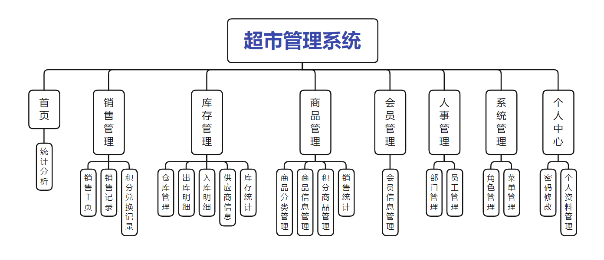
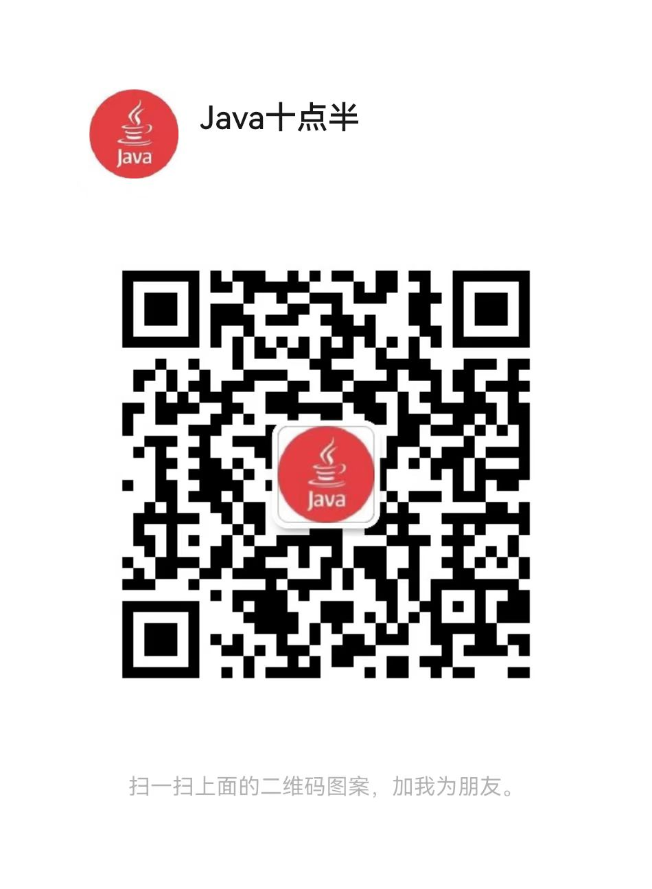

# 超市管理系统 

##（源代码+12000字文档+ppt）

## 项目简介
超市管理系统是一套基于SpringBoot的前后端分离的系统，可以自定义不同的角色分配不同的菜单权限。 
本系统包含商品管理、会员管理、库存管理、销售管理、员工管理等功能，用户购买商品可以选择不同的付款方式，会员购买商品可以获得积分，积分可以兑换积分商品。 
前端使用Vue框架，后端使用SpringBoot框架，数据库使用的是Mysql。 
本系统功能完善，涉及的技术比较广，难度适中，都是市面上主流的技术，非常适合作为设计项目或开发学习。 
视频介绍：<a href="https://www.bilibili.com/video/BV1h8PDeFEfu/?spm_id_from=333.1387.homepage.video_card.click" target="_blank">点击查看B站视频介绍</a>

## 功能介绍

## 技术学习

如果你有任何需求，可以关注本人公众号获取本人联系方式进行咨询。 
公众号内还有更多项目供你选择。 

## 技术服务

## 技术栈

| 工具及技术             | 版本    |
| ---------------------- | ------- |
| idea                   |         |
| JDK                    | 1.8     |
| SpringBoot             | 2.2.1   |
| MyBatis                | 1.3.2   |
| JWT                    | 3.4     |
| Vue                    | 2.0     |
| ElementUI              | 2.0     |
| MySQL                  | 5.7     |
| Node                   | v16.16.0|

## 系统图片

#### 1.登录页面
 
#### 2.统计分析
 
#### 3.商品信息
 
#### 4.会员信息
 
#### 5.销售主页
 
#### 6.销售记录
 
#### 7.员工管理
 
#### 8.仓库管理
 
#### 9.入库管理
 
#### 10.供应商管理
 

